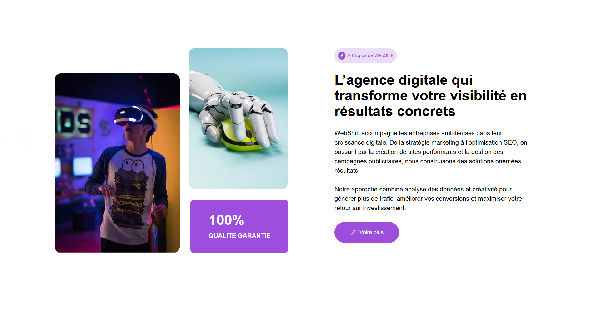
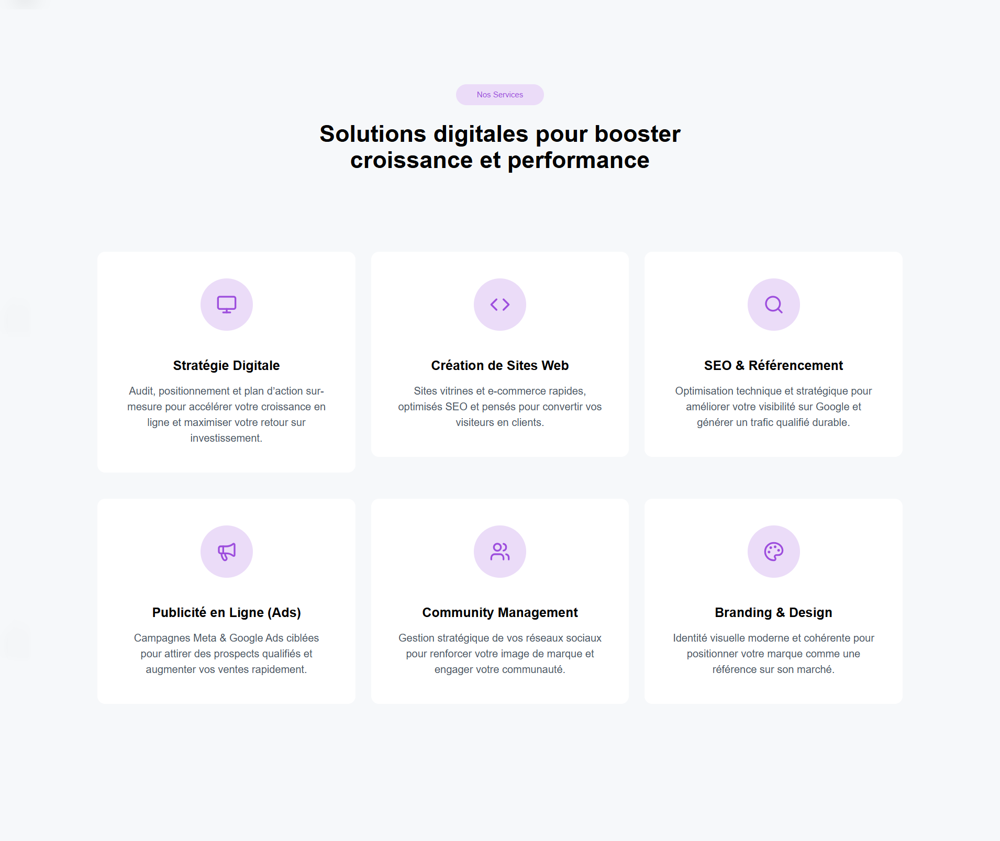
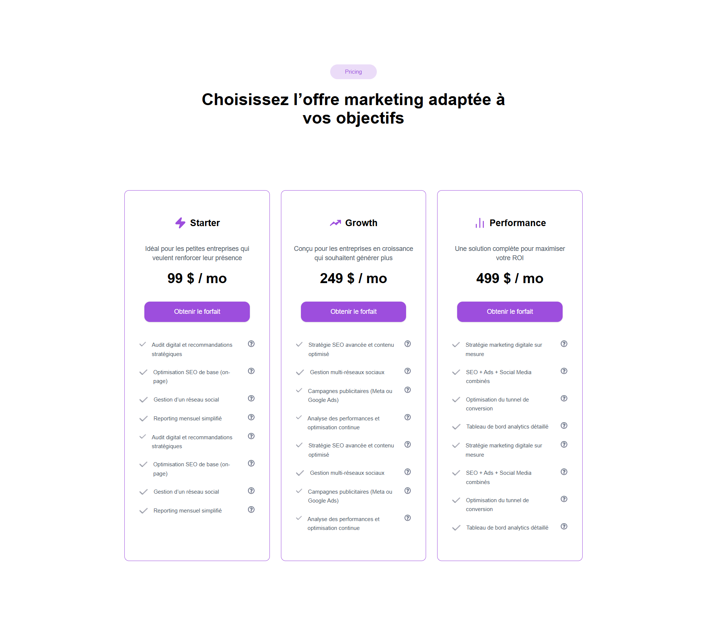
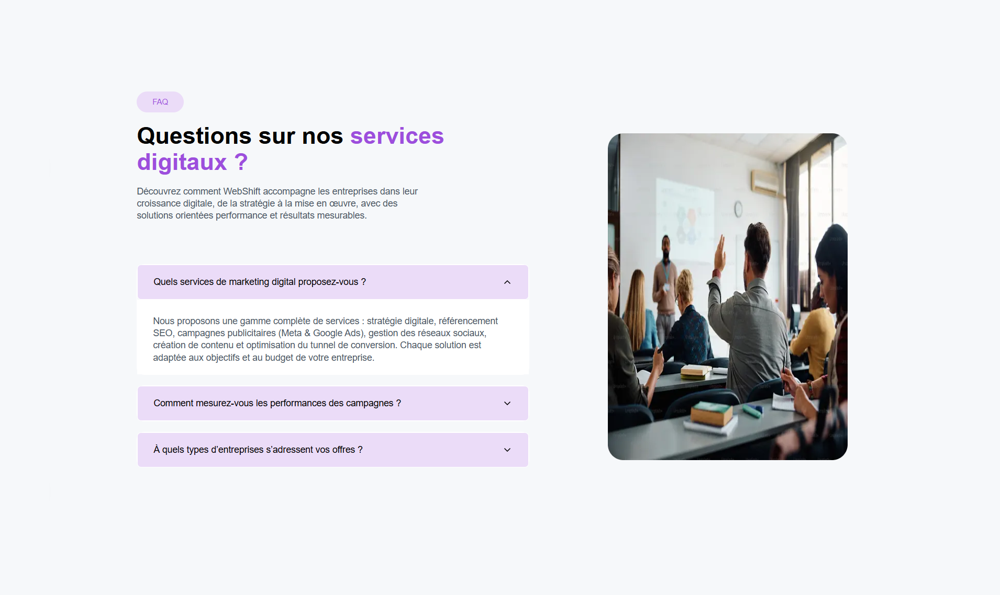
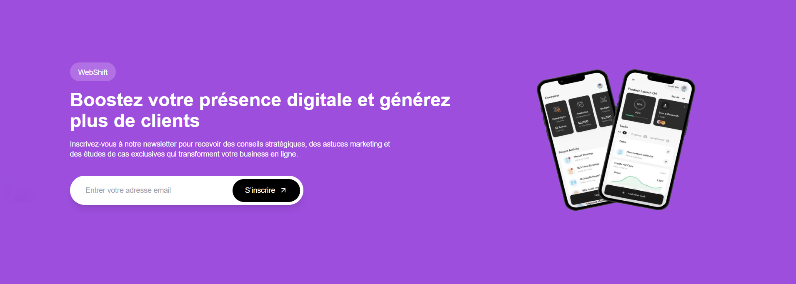
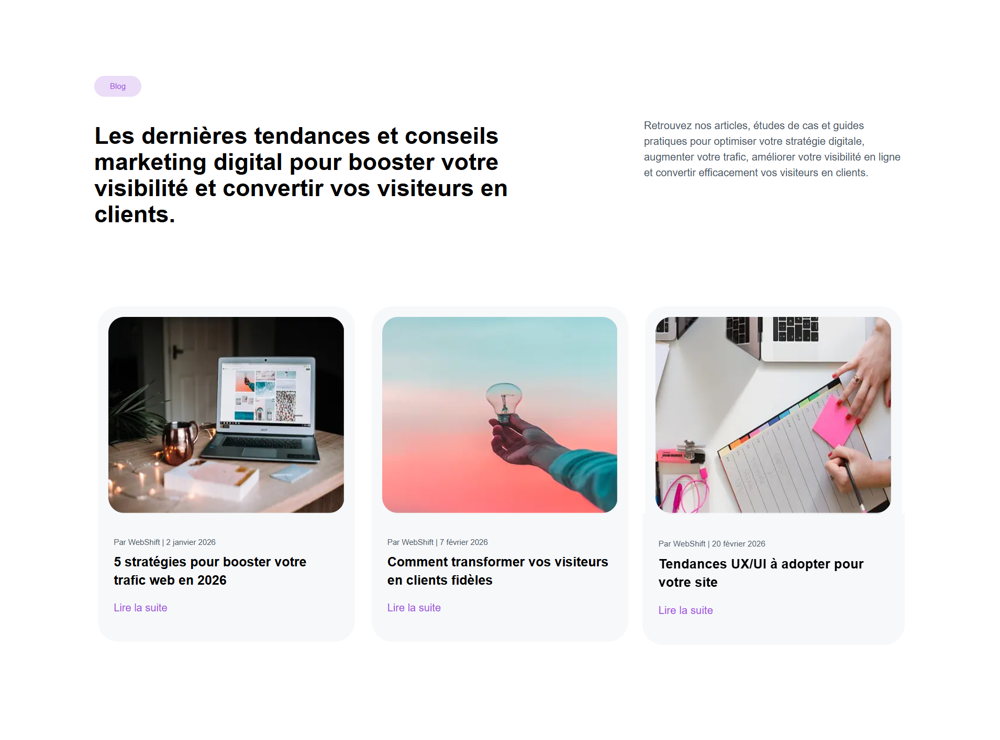
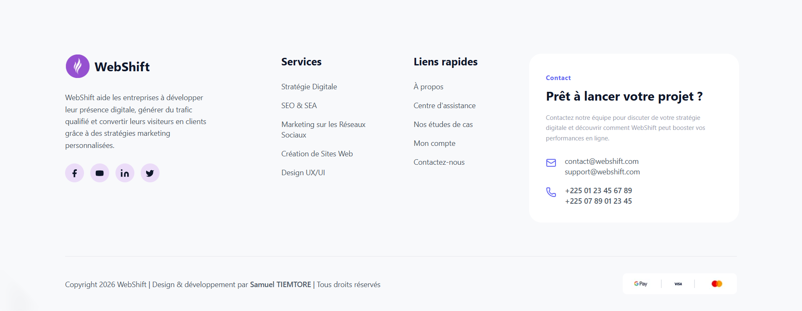

# WebShift — Showcase Website (Next.js)

**WebShift**, a modern and responsive showcase website dedicated to digital marketing, acquisition, and online branding services.


## About

This website was designed to showcase a digital marketing agency, highlight its areas of expertise, and allow potential clients to easily get in touch.


## Project Goals

* Showcase digital services
* Present a professional positioning
* Display results, case studies, and testimonials
* Convert visitors into leads through an optimized form

**Note:** This is a prototype. this site is compatible only mobile, tablette and PC.


## Technologies Used

* **Next.js / React.js** — Modern and fast framework
* **Tailwind CSS** — Responsive and high-performance design
* **TypeScript** — Robust and maintainable code
* **Framer Motion** — Smooth animations


## Features

* Modern and responsive homepage
* **Navbar** section 
* **Hero** section 
* **Banner** section 
* **About** section 
* **Services** section 
* **Pricing** section 
* **Testimonial** section 
* **CTA** section 
* **blog** section 
* **Footer** section 
* Fully responsive design 
* Basic SEO optimization 


## Upcoming Features

* **EmailJS / Internal API (coming soon)** — For estimate submission
* **Add other feature and section**


## Screenshots

| Home | Banner |
|-------|---------|
|  |  |
| About | Services |
|  |  |
| Pricing | FAQS |
|  |  |
| Testimonial | CTA |
|  |  |
| Blog | Footer |
|  |  |


## Site web

**See site WebShift** :
[site-vitrine-web-shift.vercel.app](https://site-vitrine-web-shift.vercel.app)


## Project architecture


```bash

assets/              # screenshots for README

public/
└── assets/          # images and ressources use by application

src/
├── app/             # routing and pages Next.js
├── features/        # fonctionnality 
├── components/      # component UI globals
├── providers/
├── lib/             

types/                # types TypeScript globals

README.md            # projet docs

```

## Installation & Launch

### Clone the project

```bash
git clone https://github.com/samiTelo/Site-vitrine-WebShift.git
cd Site-vitrine-WebShift
```

### Install dependencies

```bash
npm install
```

### Start the development server

```bash
npm run dev
```

### Build for production

```bash
npm run build
```

---


## Author

**Tiemtore Samuel**
Email: [samueltiemtore10@gmail.com](mailto:samueltiemtore10@gmail.com)

## License

This project is licensed under the MIT License. All right reserved

